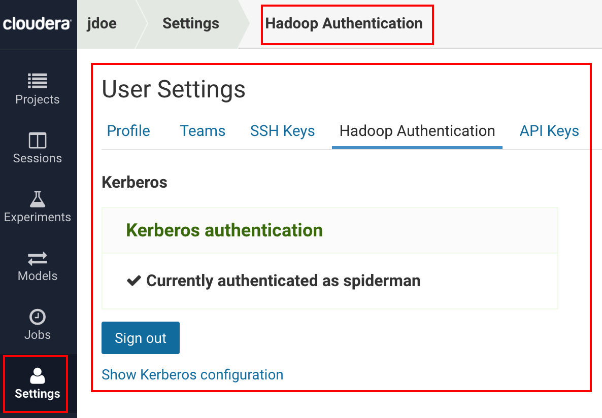
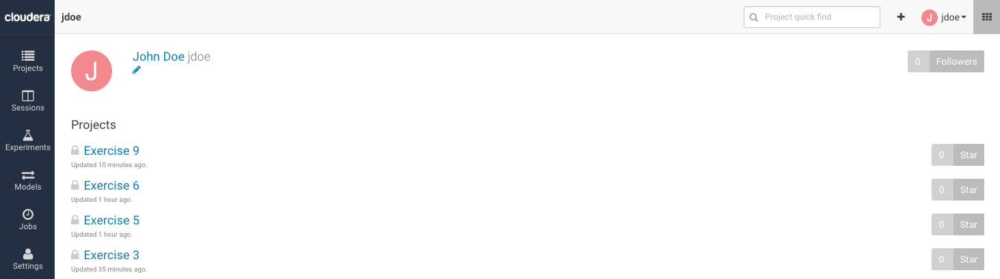
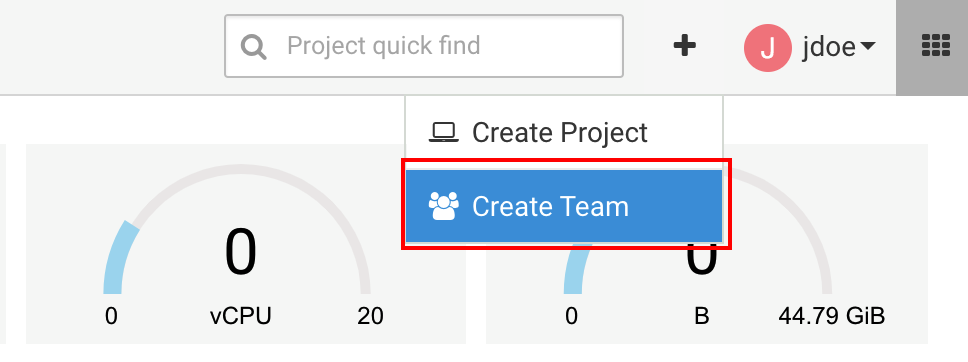
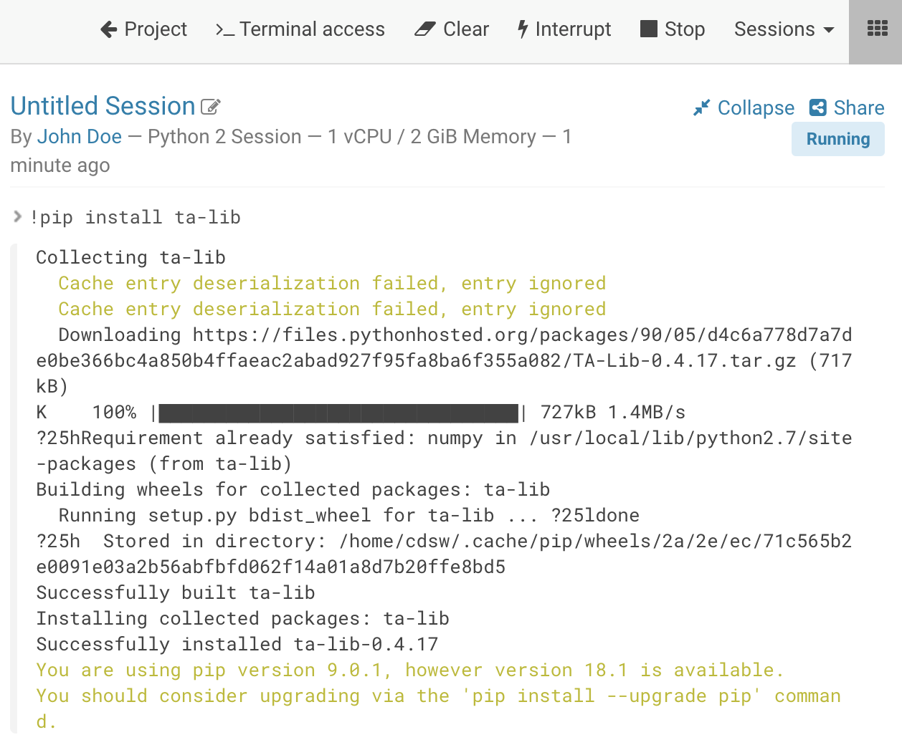

# Exercise Manual

Nov 8<sup>th</sup>, 2018 Created by Sandy Su

Version 1 Systems Engineer @ Cloudera


## Exercise 1: Access & Team Management

Now that we have had an overview of CDSW, let’s get our hands dirty. The
first thing we’ll need to do is log into the system. Sign up You should
have received a login slip from the instructor. Navigate to the URL your
instructor provided in your browser and sign up for an account with your
email address.


Once you are logged in, we can get started. Our CDH cluster is
completely secured with Kerberos, so we’ll need to specify in our
account profile how we can authenticate to the main CDH cluster. This
allows us to do things like run Spark jobs, connect to data in HDFS,
etc.

To do this, click on **Settings** \> **Hadoop Authentication**, and then
enter the **principal** and **credentials** that are printed on your
slip. Click Authenticate and you should get a confirmation that it was
successful. Now you’re ready to work with the cluster\!



Before we start working with data and writing code, let’s orient
ourselves in the system. Click on **Projects** in the vertical menu on
the left side of the page, which takes you back to your dashboard. This
shows you a list of your projects in the system, filtered by your
current context (we’ll discuss this in a minute). You can click on any
project to start creating and running code. The menu on the left has
links to switch between different parts of the application, such as
**Projects**, **Jobs**, **Sessions**, and **User Settings**. The top of
the page shows a breadcrumb trail that allows you to navigate through
the system. Below the breadcrumb trail and above the project list is a
panel displaying the system resources. This corresponds to the resources
available and being used in the CDSW cluster (not the main CDH cluster).
You’ll see 5 boxes – sessions running, jobs running, models running,
vCPU, and Memory, and a 6<sup>th</sup> one – GPU – if you have a
GPU-enabled node in your CDSW cluster (in this lab we did not add a
GPU-enabled node, so you will only see 4 boxes). The blue bar shows how
many resources are being used in the system, whereas the green bar shows
how many you are taking up. You can hover over a bar to display their
values, but by default it will always display how many resources you are
currently using.



**Projects** are the main tool to organize and run code in CDSW. This is
where we will be spending most of our time. Before we dive into that,
however, we need to be able to specify who we want to collaborate with.
This is mainly accomplished in CDSW via **Teams**. Let’s see how to
create a new Team.

At the top of the page you’ll see the name of the user you logged in as,
as well as a big **+** to the left of it. Click the **+** and select
**Create Team**.



Now enter the name of your team. Give it a unique name that will allow
you to distinguish it from other people’s teams in the system, like
“\<first\_name\>’s Avengers” or “\<initials\> Justice League”. Click
**Create Team**.


The next screen allows you to add people to collaborate with. You are
really impressed with one of your colleague’s knowledge of data science,
and you may want them to help you out with some of the upcoming
challenges. Type “**t**” into the top box and then select the first
option that pops up in the autocomplete: “**Tom Smith**”. After a second
you should see Tom Smith added to your team.


In the row with Tom Smith’s name, click **Change.** This shows how you
can modify what roles users have in your team. Some may be *viewers*,
meaning they can’t create projects but can be added to existing ones,
some may be *contributors*, meaning they can create projects and be
added to existing ones, and some may be *admins*, which means they have
full access to all projects in the team. Let’s leave Tom Smith’s role at
contributor for now. This is also where you can edit or remove existing
team members’ roles in the future.


Before we start working with projects, go back to the dashboard by
clicking on **Projects**. In the top right corner, you should notice
your context has switched to the team you just created. If you click the
drop down, you’ll see you can switch back to your personal user account.
We don’t have any projects yet, but this is how you can switch between
different teams in the system and your list of projects will be
displayed based that team.


## Exercise 2: Creating a New Project from Scratch

Now we are ready to create a project\! *Projects* is where you will
write and execute code in the system. This is where you will likely
spend most of your time when using CDSW. Let’s create a new project.
Make sure you are on your dashboard, then you can either click the arrow
in the top toolbar and click **Create Project**, or click the blue **New
Project** button below your resource toolbar.


You should see a short form to fill out for your new project. First,
select which account to place this project in. Let’s select **the team
we created in Exercise 1**. Now, give your project a name, like
**“Exercise 2”**. Next, select who will be able to access the project.
For this example, let’s select **Team**, which will make the project
available to everyone on our team, with the roles defined in the team.
It’s also possible to make a project private, or public. We can always
change the visibility later. Lastly, we can optionally provide some
information on the types of files we want to include in the project.
Select Template \> Python. CDSW comes with a few templates which are
mainly for demonstrative purposes, and system admins can also upload
custom templates into the system. We can optionally create a blank
project, upload local files from our laptop, or clone an existing github
project. We’ll explore some of these other options in future exercises.
When finished, click **Create Project**.


After creating a project, you’ll be taken to the project dashboard. This
provides a high-level overview of the project. At a glance, you’ll be
able to see which **Jobs** have been configured for the project, a list
of **Files** in the project (you can also upload and download files from
here), and any description provided in the form of a **README.md** file.
Notice that since we selected a python template, we already have some
pre-populated files in this project. You can also modify who has access
to the project by clicking **Team** on the left menu and adding project
collaborators. Like the team settings, projects have 3 levels of access:
*viewer*, who only has read-access, *contributor*, who can modify and
execute project, and *admin*, who has full access to the system. You’ll
spend most of the time in your project working in the workbench, so
click the blue **Open Workbench** button at the top of the page.


The workbench is broken into three panels. On the left is the list of
*Files*, the middle panel is your *Editor*, and the right panel is your
interactive *Session*. By selecting a file in the file list, the editor
will display its content. Try this by clicking on **analysis.py** to
display its contents. You’ll notice the file loads up in the editor, and
you can modify or enter code in here to modify your *script*. For now,
we don’t need to modify anything, so let’s just run our code.

To do so, we’ll need to create an interactive session. On the right,
CDSW is asking us to specify which type of session we want (Python 2,
Python 3, Scala, or R) and the resources we need for those sessions
(Note: if using gpu-enabled nodes, you can also request GPU resources
here as well). Both items are configurable by an admin (we’ll look at
this a little later): you can modify the base images CDSW provides and
create larger instance sizes if needed. Select **Python 2**, **1 vCPU/2
GiB**, and click **Launch Session**.


On the back end, CDSW provisions out a Docker container from which to
run all your code. This is isolated from other users in the system, so
you won’t have to worry about dependency conflicts, resource contention,
etc. After launching the session, you should see a message about the
container creating, and then the session starting. This should only take
a few seconds for common engine types. After that, the console will have
a green bar at the bottom, which means it is ready to use. Let’s test it
out by typing the following and hitting enter:

```
print "Hello World!"
```


CDSW executes your code in the session, and you’ll see the results
displayed immediately. Our base engine is based off a Jupyter kernel, so
users familiar with working in Jupyter Notebooks should find the
experience very similar. I.E. many [<span class="underline">magics are
supported</span>](https://www.chttps//www.cloudera.com/documentation/data-science-workbench/latest/loudera.com/documentation/data-science-workbench/latest/topics/cdsw_jupyter.htmlhttps://www.cloudera.com/documentation/data-science-workbench/latest/topics/cdsw_jupy),
etc. This session provides a typical python experience to users, so you
can freely run local python processes from here (later we’ll discuss
connecting to the cluster to run distributed spark jobs, etc). For now,
let’s just run our existing code in the session. To do that, you can
either click the **Play** button on the top of the editor, or click
**Run** and select **Run All**.


Your code should run in just a few seconds. Notice that our code
contains some visualizations and also demonstrates working with popular
libraries like *pandas* and *seaborn*. The CDSW base engine comes with
many libraries pre-installed, including these, and users also have the
ability to install additional dependencies as needed (more on this
later). The goal here is to give Python users a familiar experience
while connecting them to big data resources.


We are finished with this exercise, let’s just free up our resources as
a last step. To do this, click the Stop button on the top of the
session. This destroys the docker container and frees up the system
resources. Don’t worry, your code is still saved in your project and we
also keep a history of all your past sessions, should you wish to
revisit them.


## Exercise 3: Creating a New Project from Github

In this exercise, we’ll show how you can setup a project from an
existing Github repository. We’ll also look at a project that uses Spark
to interact with the cluster. Navigate back to the main dashboard. If
you’re still in the workbench for Exercise 2, click **Project** at the
top of the page, and then Account.


We need to create a new project so Click **Create Project** like we did
in Exercise 2. Put this project in your **Personal Account** instead of
your team account, Give the project a name like **“Exercise 3”**, make
it a **Private** project and initialize the project with **Git** by
using the following
URL: [<span class="underline">https://github.com/jordanvolz/BasketballStatsCDSW</span>](https://github.com/jordanvolz/BasketballStatsCDSW)


Click **Create Project**. This will clone the repository and create a
new CDSW project with the contents of that repo. You should see a page
that looks something like the following image. This project already has
several scripts around data processing, data analytics, and machine
learning that we can use in CDSW.


Before we get started in the workbench, let’s add a collaborator to the
project. We didn’t put this project in a team, but we can still add
users to the project who we want to collaborate with. Click on **Team**
on the left and then search for the user **Tom Smith.** Add him to the
project, and you change his permission from ‘Viewer’ to ‘Admin’.


We can always ad-hoc add users to our personal projects. Your personal
projects by default will contain you as the sole collaborator, so if you
expect to be working with other people, it’s a best practice to use
Teams to reduce the administrative steps at project creation.

Now let’s look at the project. Navigate back to the project dashboard by
clicking **Overview** and click **Open Workbench**. If you inspect the
project’s REAMDE.md, you’ll notice that the author has provided some
steps for using this project. The first step is running a setup script
that will place data into HDFS so that we can access it with Spark. We
have already copied this data into HDFS, ***so you do not need to run
setup.scala***.

Instead, open a session that uses the **Scala** kernel with **1 vCPU/2
GiB RAM**. It should take the system about 15 seconds to provision out
your Scala image. Scala takes a little longer to spin up because our
kernel for Scala establishes a spark connection automatically, which
takes a few seconds to set up.

Once your session is ready, click on **data\_processing.scala** to load
the script into the editor. This script is almost ready to run as is.
The one modification we will make is to replace “\<Your User Name\>”
with the first part of Kerberos Principal. For example, my Kerberos
Principal is “spiderman@HADOOPSECURITY.LOCAL”, so my first line reads:

**val dbName = "spiderman"**

The script will use this to create a Hive database of that name and
create your tables underneath it. Once that edit has been made, you can
run the entire script by clicking the **Play** button or selecting **Run
All**. This script performs several rounds of data processing on the
data we uploaded into HDFS and generates a few Hive tables. If you’re
interested in the technical details of this script, feel free to speak
to the instructor (there’s also a few blog posts linked in the README.md
file).

The script will probably take \~1 min to run. When it is finished, let’s
check that our tables were created correctly by running the following
command:
```
spark.sql(s"Select name, zTot from $dbName.players where year=2017 limit 10").show
```
You should see a small table produced, like below (note: the actual entries will differ):


Now let’s look at the data analytics script. Click **analysis.py** to
open the script in the editor. Again, change the first line in the
script to replace “\<Your User Name\>” with the name of your system
user.

**dbName = "< YOUR USER NAME >"**

We have a python script, but a scala session is running. Clearly, we
can’t run python code in a Scala kernel. We’ll need to create a new
Python2 session for our python code. CDSW lets you run multiple sessions
at a time, as long as it has enough resources to satisfy the requests.
Before we create a new session, let’s rename our current Scala session
so that we can better identify it. At the top of the Session you should
see the text “Untitled Session”. Click the **Pencil** next to it to edit
the name and rename it something more descriptive, like **“\<User
Name\>’s Scala Session”,** then click **Done**. This should replace
the name of your session.


Now click the **Sessions** drop down menu at the top of the Sessions
panel. You’ll see an entry for your current session, as well as the
option to create a new session. Click “New Session” Then create a
**Python 2** session with **1 vCPU/2 GiB RAM**.


Once the session has started, you can optionally rename it like we did
with the Scala Session. This will help organize your sessions if you
start running many of them in the same project (something like **“\<User
Name\>’s Python Session”** might be nice\!). Now we can run the python
script by selecting **Play** or **Run All**. When the script finishes,
feel free to browse through it. What we do in this script is connect to
the tables we created in the data\_processing.scala script and run some
visualizations on it using common Python methods. (Note: If you receive
an error message about CDSW not having enough resources to create your
session, try terminating your Scala session and then starting your
Python2 session. If that doesn’t work, contact the Instructor, as it’s
possible we’ve exhausted resources in the cluster and need to add some
more nodes).

Notice that the Sessions dropdown menu allows you to switch between your
running sessions in the project. This can be useful when multi-tasking –
perhaps one session is running a lengthy model training or scoring
session, you can easily go work on something else and return to the
session later. This also allows you to run different scripts in
different languages as needed.

We’re done with the workbench, but before we leave, let’s return to our
starting point of having code on Github. We were able to pull code down
from github, but what if we wanted to push it back to a repository? CDSW
gives users shell access into their container, where they can make use
of common CLI tools like git. At the top of the session click **Terminal
Access**. This will pop up a new window which contains a terminal. Git
is already installed in the base image. Run a command like **“git
status” or “git help”** in order to interact with git. This is where
you would be able to commit changes back to a git repository, if you had
suitable permissions. (Note that your CDSW user settings contains a SSH
key that you can add to your github account to allow the tool to push
code on your behalf. See the
[<span class="underline">documentation</span>](https://www.cloudera.com/documentation/data-science-workbench/latest/topics/cdsw_using_git.html)
for more details.)


We’re done with this project, so let’s return to our dashboard
(**Project** \> **Accounts**). If you neglected to close your sessions,
you’ll notice that the resource monitors now display how many resources
you are using on the CDSW nodes, and your Exercise 3 project shows that
2 sessions are running:


Also notice that since you are in your personal context, you only see
the Exercise 3 project. You can switch to your team context via the
dropdown in the top right to see that Exercise 2 is located in that team
context.


Now let’s stop our sessions to free up resources for others. To do this,
we don’t need to return to the project. Make sure you’re in your
personal context and navigate to **Sessions** in the left vertical menu.
Locate your two running sessions and click ‘Stop’.


Note that from the Sessions page we can view any of our past sessions by
clicking the link.

## Exercise 4: Collaboration via Forking

In this exercise, we’ll look at another way we can create projects –
forking them from existing projects in the system. CDSW has a “forking”
functionality that allows you to copy, or “fork” a project from one
context to another. Although it is possible for multiple users to modify
the same project, it can sometimes be confusing if two users are
modifying the same file, and generally it is advisable to have users
fork their own copy and then use a repository management system like
Github as the golden source. CDSW’s forking capability enables this type
of workflow, which is popular with enterprise organizations. We’ll take
a quick look at how this works.

If you navigate your browser to
[<span class="underline">http://cdsw.34.219.208.168.nip.io/explore</span>](http://cdsw.34.219.208.168.nip.io/explore),
this will show you public projects in the system. Locate a project
called **“Exercise 4 - US Flight Analytics**” by the user **“admin”**
and open it, or just navigate to this link:
<span class="underline">[http://](http://cdsw.54.70.226.3.nip.io/admin/exercise-4-us-flight-analytics)[cdsw.34.219.208.168.nip.io](http://cdsw.54.70.226.3.nip.io/explore)[/admin/exercise-4-us-flight-analytics](http://cdsw.54.70.226.3.nip.io/admin/exercise-4-us-flight-analytics)</span>.


Click the **Fork** button in the top right corner of the project, then
select which team to create the project under, such as the **team you
created in Exercise 1**.


New forked project:


This will copy the project into the new team and load the project
dashboard. Click **Open** **Workbench,** select the
**flight-analytics.R** file, and open a session with the **R kernel**
and **1 vCPU/2 GiB RAM** resources. Click the **Play** button or **Run
All** to run the script. This project uses the sparklyR packages to
connect to Spark and analyze US flight data. Feel free to browse through
it to see what is going on. When finished, **Stop** your session from
the workbench.

Before exiting the workbench, inspect the **setup.R** file. The creator
of this project has specified a few dependencies that are required to
make this project run, which can be installed via install.packages off
or CRAN. If you were to create a brand new project and copy the code
into it, you would have to setup these dependencies again, which is why
the setup.R file exists. In our case, we used **Fork** to copy the
project files, including the dependencies, and *did not have to
reinstall any packages*. CDSW’s fork functionality copies over the
existing dependencies, which makes sharing work easy in the system. The
user who understands what dependencies are needed for a project may not
always be the one running it, and it can often be complicated to work
out what is needed for the code to successfully run. In CDSW, the
project owner can work out the dependencies and other users can Fork the
work and not have to worry about any of the messy setup.

## Exercise 5: Customizing Projects via Installing Libraries Locally

We’re now experts at understanding how to create and share projects, as
well as running code in the system, and we’ve also seen a few examples
of interacting with distributed frameworks, like Apache Spark. Let’s
take a deeper look into working with dependencies. In the last example,
we saw that by forking a current project, we can copy dependencies and
not worry about it, but unfortunately that won’t always be the case.
Sometimes you may be creating new code that needs certain libraries and
you’ll have to work those out. We’ll see how to accomplish this in this
exercise.

Make sure all your current sessions are closed, and create a new project
entitled “Exercise 5”. You can decide which team to place it under and
the visibility. Select “Blank” for the initialization. Open the
workbench and select **File** \> **New File**, and name the file
**plotly_test.py**.

```
dbName = "<your user name>"

from plotly.graph_objs import Scatter
from plotly.offline import plot
from pyspark.sql import SparkSession
from IPython.display import HTML

spark = SparkSession.builder \
      .appName("%s basketball analysis" %(dbName)) \
      .getOrCreate()

spark

## Set up pandas dataframe
pdPlayers = spark.sql("SELECT * from %s.players" %(dbName)).toPandas()

spark.stop

points={ 'data' : ([{
    "x": pdPlayers.age,
    "y": pdPlayers.PTS,
    "mode" : 'markers',
    "text" : pdPlayers.name, 
}]),
  'layout': {
      'xaxis': {'title': 'Age'},
      'yaxis': {'title': "Points"}
    }
}

plot(points,filename="/cdn/%s-bball-plot.html" %(dbName))

HTML("<iframe width=600px height=600px src=%s-bball-plot.html />" %(dbName))
```

Run the file in a python 2 session. Notice we get an error:


This error tells us that our container doesn’t have the
[<span class="underline">plotly</span>](http://plot.ly) library. Plotly
is a visualization library that creates interactive visualizations and
supports online and offline use. Indeed, plotly is not contained in our
base image, so we will need to add it. This can easily be done with the
following.

Create a new file named **requirements.txt**. On the first line, simply
write “**plotly”**. A requirements.txt file is often used with pip to
list dependencies. We can install everything in requirements.txt via
“**pip install -r requirements.txt**”. You can either open a Terminal
session and run that command, or run it in the interactive session by
prepending a “\!” to it, i.e. “\!pip install -r requirements.txt”


Be sure in the first line in the script to replace “\<Your User Name\>”
with the name of your system user.

**dbName = " < YOUR USER NAME >"**

Now try to run your file again.

You should now be able to produce an interactive graph, as below.


CDSW allows users to install and load libraries using methods they are
already familiar with. Python users are likely familiar with tools such
as pip and conda (both of which are pre-installed on the base image),
and R users should be familiar with CRAN. If your installation of CDSW
is connected to the internet, you can pull from public repositories,
otherwise you can modify these tools to point to local mirrors. Scala
users generally load in their dependencies via jar files, which is also
supported in CDSW.

Note that you won’t need to install these libraries for every session.
You only need to do it *once* per project. To demonstrate this, close
your current session, then open a new python2 session and re-run your
code without pip installing plotly. Does it work? It should\!

As we saw in Example 5, any forks will automatically carry over these
dependencies and other users won’t have to worry about setting them up.
Users can customize each project by bringing in libraries they need,
when they need them. In the next section, we’ll explore a different
method of customizing projects which can be useful when your
dependencies exist outside of pip/conda/cran/jar files.


## Exercise 6: Customizing Projects via Changing Project Engines

In this exercise, we’ll look at working with libraries that have
advanced dependencies.
[<span class="underline">TA-Lib</span>](http://ta-lib.org/) is a library
used by developers in financial services companies to perform technical
analysis on market data. There is a [<span class="underline">python
wrapper</span>](https://github.com/mrjbq7/ta-lib) for the project, so
let’s see if a python user can use this in CDSW.

Make sure all your sessions are closed. Create a new project titled
**“Exercise 6”**. Place it into whichever team you want with whatever
visibility desired and choose to start from a blank project. The TA-Lib
documentation contains a [<span class="underline">few python
examples</span>](https://mrjbq7.github.io/ta-lib/), let’s see if we can
get them to work. Create a new file, called **“ta-lib\_test.py”** and
past the following into it:
```
import numpy 
import talib
close = numpy.random.random(100) 
output = talib.SMA(close)
output
from talib import MA_Type
upper, middle, lower = talib.BBANDS(close, matype=MA_Type.T3) 
upper
middle
lower
output = talib.MOM(close, timeperiod=5)
output
```

Open a **Python 2** session with **1 vCPU/2 GiB RAM** and run the code.
You should get the following error:


Hopefully this error makes sense after Exercise 5. We need to first
install the ta-lib library. As we did in exercise 5, you can create a
**requirements.txt** file with “**ta-lib**” (note: there is a hyphen in
the name) or simply issue **\!pip install -r requirements.txt** or
**\!pip install ta-lib** from the command line. Do one of those, and you
should get an error with the following:


This error message is a little more mysterious, but a little
troubleshooting reveals that there is an underlying C++ library that
needs to be installed on the host before the python wrapper will
successfully install (See, for example,
[<span class="underline">this</span>](https://github.com/mrjbq7/ta-lib#linux)).

While we have a lot of freedom in our dockerized environment, we don’t
have sudo access, so we’re unable to install these libraries in the
container. However, there is something we can do to resolve this issue.
Cloudera provides a base image for our three kernels, but we also allow
users to extend them by installing additional software on top of it and
loading it back into CDSW. The process of doing this is outside the
scope of this course and requires some working knowledge of Docker.
Suffice to say that this is more of an administrative task, and luckily,
we’ve already loaded the final engine into the environment for you to
use. All you need to do is tell your project to use the new Engine.

We haven’t yet looked at the projects settings page, so navigate there
now via **Projects** \> **Settings**. Then click **Engine**. Under
Engine Image, click the drop down menu and select the Image for
**TA-Lib**. At the bottom of the page, select **Save Environment**.


You can now return to the workbench. Note that you’ll need to stop your
old session and start a new one in order to refresh the engine. Also,
you may notice that when starting a new session, your engine image is
now different. There is also a **Configure** link here that will take
you to the project settings if you want a quick way to change the engine
image of your project.


Once you’ve done that (Note: the first time you use a new engine in
CDSW, CDSW needs to download it from the docker repository. Docker
images can be GBs in size, so it can take a few minutes to start your
first session with an image), try to **\!pip install ta-lib** again.



This time we are in luck and ta-lib is installed. Now, run the code to
see if it works. This time the code completes successfully:


This example demonstrates how users can satisfy advanced dependency
requirements via extended engine images and importing them into their
projects.

## Exercise 7: Sharing Results

We’re now experts at customizing our projects so that we can work with
precisely the tools we need. There’s no barriers now to doing great work
with CDSW and the next step is showing off your work to others\! In this
exercise, we’ll quickly learn how we can share our results with others
in our organization.

CDSW makes it easy to share the results of your session. When you have a
running session, there is a **Share** link at the top right of the
session. Click the link, then “Share With Others” in order to start
sharing. CDSW will immediately display some share options, from which
you can decide whether you want to make the links available to anyone
with the links (aka anonymous users), force visitors to be logged in to
view, or specific users/teams who can access the link.


When accessing the link, authorized users will be able to see a static
html view of the session.


Note that this functionality is not limited to currently running
sessions. You may also generate a share link from old session by opening
them from the Sessions view and following the same process.

## Exercise 8: Automation via Jobs

The next exercise we’ll look at is looking at CDSW’s job functionality,
which allows users to begin automating their code by running it on a
schedule. This feature allows users to automate common tasks and chain
together different pieces of code to create complex workflows and it is
particularly useful for model training and batch or offline scoring.

Open your project for **Exercise 3**. At the top of the dashboard, the
Jobs section notifies us that we don’t have any jobs for this project\!
Let’s fix that by click on **Create New Job**.


CDSW will pop up a form to fill out to tell it what you want to run and
how you want it to run. This is very similar to creating an interactive
session, as your job will also run within the CDSW engine in a Docker
container.

Give the project a name, such as **“\<Your User Name\> Data Processing
Job”**. Next, select a script from the project that you want to run. In
this case, select **data\_processing.scala**. Now, select the Engine
Kernel to attach to the Docker container, **Scala** in this case. Choose
a schedule to run on. Select **Recurring**, choose every **Day**, and
select a time of day. Next, select the **1 vCPU/2 GiB RAM** engine
profile for the resources. This is all that is required. Optionally you
may do things like specify Environment Variables for the project,
specify job report recipients, and modify the timeout limit. Scroll to
the bottom and click **Create Job**.


Now we have 1 job\! Before we run it, let’s connect it to a second job.
Click **New Job** in the top right corner and let’s create a second job.
This time, we’ll create it based on the **analysis.py** script, and we
will schedule it to be **dependent** on the first job we created. Your
job should look something like below. When finished, click **Create
Job**.


Since we created a dependent job, we notice that our jobs are connected
in a chain. The chain doesn’t have to be 1-1. We could, for example,
have many jobs dependent upon a parent job, which would then branch off
with different actions. If you don’t want to wait for the scheduled job,
you can run your jobs ad-hoc from the jobs page. Press Run next to the
job **“\<Your User Name\> Data Processing**”


It should take approximately 2-3 minutes to run through both jobs. When
they are finished, click on the **Data Analysis** job to drill into the
details. As your job runs, you’ll generate a graph that details the
duration of each run, as well as whether or not it was successful.


We can get a table view of this via the History tab, and for any run we
can drill down into it to see the output of the job.


The other two tabs allow us to view the job dependency graph, as well as
updating the settings for the job.

Note that the job functionality may also be called via the
[<span class="underline">Jobs
API</span>](https://www.cloudera.com/documentation/data-science-workbench/latest/topics/cdsw_rest_apis.html).
This can be useful in connecting CDSW processes to external tools. For
example, you may have an ETL pipeline that ingests data into the cluster
and then runs a job in CDSW to kick off batch scoring of the new data
set with an existing model.


## Exercise 9: Experiments (CDSW 1.4+ Only)

If you’re using CDSW v1.4 or above, you’ll have access to the new
features *Experiments* and *Models*. In this exercise, we’ll look at the
experiments functionality.

Navigate back to your dashboard and create a new project using the
github repo:
[<span class="underline">https://github.com/jordanvolz/dsfortelcoCDSW</span>](https://github.com/jordanvolz/dsfortelcoCDSW).
After the project has been cloned, navigate to the workbench and launch
a **Python 2** session with **1 vCPU / 2 GiB RAM**. Open up a Terminal
window and run the **setup.sh script**.


This will perform a few preliminary actions that will make our project
ready to use. Click on **dsfortelco\_interactive.py** and run this file.
This project takes a sample telco dataset and creates a pyspark model to
predict customer churn. This file takes you through a standard
explorative practice including data visualization and feature selection.
Feel free to read through it if you are interested.


Next, we want to start creating experiments. Experiments allow you to
start creating versioning runs of your project and tracking metrics,
which makes it easy to compare models and reproduce prior results.

To get started, select the **dsfortelco\_pyspark\_exp.py** file to open
it in the editor. This is a very similar file to the one we just ran,
but we’ve modified it to run as an experiment. Scroll down halfway to
the bottom and you’ll notice some changes that we have brought in.


Experiments take arguments as an input which you can access in your code
(via sys.argv). This allows you to reuse the same piece of code and plug
in different arguments, like parameters, so that you can quickly iterate
over a model in many different runs. You can also track different
variables in files in your model with the cdsw library. All you need to
do is import cdsw and utilize the cdsw.track\_metric and
cdsw\_track\_file commands to associate those with a run. Note that
experiments don’t inherit all the libraries you’ve been installing in
your project. It’s common that you’ll install many libraries in a
project to experiment with different approaches, but we want our actual
runs to be pretty slim. As a result, the runs only use the base engine,
but you can also provide a cdsw-build.sh file that will execute commands
during the build step. This can be useful if there are dependencies you
want to install for your experiment (for example, you may want to pip
install -r requirements.txt, where requirements.txt tracks all the
libraries needed for your experiment\!).

To start running experiments, click **Run \> Run Experiment.** This pops
up a window that allows you to specify the environment in which to run
your experiment.


The file is auto-populated with the open file in the editor. Enter “**10
10 gini**” as your arguments for the run, and select a small python 2
engine to run it in. Then click **Launch**.


You can now view the experiment by navigating back to the project
overview and clicking on **Experiments**. This takes you to a list of
all the experiments run. You should see your experiment at the top of
the list, along with the metrics that you are tracking (Note that you
can select which metrics to display via the dropdown menu on the top
right).


We want to compare our pyspark model to our sci-kit learn model, so
let’s generate a new experiment. We can actually kick off a new
experiment directly from this page, just click **New Run** at the top of
the page. Now choose the **dsfortelco\_sklearn\_exp.py** file, and fill
I similar information to the previous run. When the experiment finishes,
you’ll be able to compare the two runs. The metric that is most
interesting for our example is the area under the ROC, and we can
quickly discern that our pyspark model does a little better than the
sci-kit learn model.


We can drill down into any model by clicking on the Run number in the
leftmost column. Click on the pyspark model run to see it’s details. The
next page shows an overview of the model. Se can see the script run, the
snapshot created, as well as the metrics and files tracked. For any file
tracked, we have the option of saving it directly to our project. This
can be very useful if we experience regressions in our model and want to
revert to an older artifact. Since the runs are snapshotting and we are
tracking files, we can copy it back to the project and deploy it back
out as a model (which we’ll learn how to do in the next section\!). If
interested, you can also view the console output of the experiment, or
the build output.


Click the spark\_rf.tar files and select **Save to Project.** Navigate
back to the project’s main menu and notice that the spark\_rf.tar file
is now in your project files.


## Exercise 10: Model APIs

The last exercise we’ll look at is using the Models API to host a model
endpoint for online scoring. Before we create a new model api, let’s
open the workbench and open the **predict\_churn\_sklearn.py** file.
This is a very short script that loads a model (from a pickle file,
created from the **dsfortelco\_sklearn\_exp.py** script) and defines a
predict function that takes a feature as input and runs it through the
model function.


This is a simple function, but it will do just fine to illustrate the
capabilities of the Models API. Navigate back to the project overview
page and click “Create a new model”.


On the new page that pops up, you’ll give the model a name and
description, then define the build. For the build, you give it a script
and the function in that script to run as an API (such as
**predict\_churn\_sklearn.py** and **predict**). Additionally, provide a
sample input and output in JSON. In our example, we input a feature
vector and will output a churn prediction (0 for false, 1 for true).
Lastly, define the engine kernel to run it in as well as the profile and
number of replicas. Replicas allow you to create multiple copies of the
model, so that if one should fail, the others will continue to serve
results.


When finished, click **Deploy Model** at the bottom of the page. You’ll
now be at the Models dashboard. It should take a few minutes for CDSW to
build the environment for your model, but when finished, you’ll notice
that the model’s status is “deployed”.


The dashboard gives you an overview of models you have in your project
and their status, as well as quick way to start/stop models or deploy
new builds or new models entirely. Click the model you just created to
drill down into it.

The overview tab gives you information on the model – what build it is
deployed, what file is being used, what function in that files, system
resources, etc. On the bottom, you have a quick box to test the model
itself. Feel free to modify the input values and then click **Test**.
Below, it will display the output of the model (0 or 1 in this case).


Typically, you’d utilize the model in an application that would use the
API to generate real-time predictions. The top of the page provides a
few examples of working with the API, via shell, python, and R. Copy the
shell command, open a terminal on your laptop, and run the curl command.
You should get back a JSON result like the following:


The next two tabs in your model keep track of deployments and builds.
*Builds* are needed anytime a physical change is made to your model.
I.E. your scoring function changes or you make a change to the model
itself. *Deployments* are just instances of the model running. You may
only need to run a model during certain times of the day, so you can
shut it down when it’s not used.

Note that you can view old deployments and re-deploy old builds. This
can be crucial if you make a change to a model that has an unexpected
consequence. Instead of wondering how to get back your old model, you
can simply navigate to the deployments tab and re-deploy an old version.
You can also create a new build at any time as well.


The *Monitoring* tab keeps track of the currently deployed model and
bubbles up some statistics about how it’s being used. Here you’ll be
able to see how it’s handling various requests that come in.


Feel free to play around with the model deployment feature. You may also
want to try building a model for the pyspark model we created in the
previous experiment\!

## Exercise 11: Free Time\!

Congratulations\! You’ve finished the CDSW walkthrough. You now have a
strong grasp of the functionality of the tool, and how it can be used
with the CDH cluster. Feel free to use the remaining time to experiment
with the tool as you see fit. We’ll include a few suggestions below for
projects that may be worth considering, and there is also some content
in the Appendices. Let us know if you have any questions.

1)  > **Intro to Spark**:
    > [<span class="underline">https://github.com/jordanvolz/Intro-to-Spark</span>](https://github.com/jordanvolz/Intro-to-Spark)  

For those looking to get into distributed processing, Apache Spark
is the go-to tool in the CDH stack. Learning spark is far outside
the scope of this tutorial, but we have a gentle introduction on
github that was actually designed to be run in CDSW. Feel free to
create a project with it and explore if if you want to learn a
little bit more about how Spark can be leveraged with CDSW. Note
that the cluster we’ve provided doesn’t have all CDH components
installed and not all the subsections of this project will be able
to complete. Contact the instructor if you have issues with
anything.

2)  > **DS for Telco**:
    > [<span class="underline">https://drive.google.com/file/d/0B0we1KVH\_icsODhIc0tySjdYelk/view?usp=sharing</span>](https://drive.google.com/file/d/0B0we1KVH_icsODhIc0tySjdYelk/view?usp=sharing)

This is the project the instructor went through in his quick demo.
This is a good example of using Spark for a quick DS workflow,
including feature selection, featuring engineering, modeling, and
scoring. Tip: Download the zip, upload it to a new project, and then
unzip the file from within the CDSW terminal.

3)  > **Tensorflow**:
    > [<span class="underline">http://cdsw.jvolz-cloudera.com/jordan/tensorflow-tutorial</span>](http://cdsw.jvolz-cloudera.com/jordan/tensorflow-tutorial)

Tensorflow is a very popular library. This is a canonical example of
using tensorflow to learn how to classify letters via handwriting
samples. We have an existing project on the cluster, simple fork it
and run the python script in a python session.

4)  > **BigDL**:
    > [<span class="underline">https://drive.google.com/file/d/0B0we1KVH\_icsalBwbzZTZ1gwQVk/view?usp=sharing</span>](https://drive.google.com/file/d/0B0we1KVH_icsalBwbzZTZ1gwQVk/view?usp=sharing)  

BigDL is a new deep learning framework spearheaded by Intel that
runs on Spark and is designed to utilize common CPU instead of the
more expensive GPU. We have a project collected in a zip jar. You
can upload it to a project and play with it. It is based on the
following [<span class="underline">blog post ](https://blog.cloudera.com/blog/2017/04/deep-learning-frameworks-on-cdh-and-cloudera-data-science-workbench/ ).

## Appendix A: Resources/Links 

Here are some resources and links that may be useful as you explore
CDSW:

1)  > CDSW public documentation:
    > [<span class="underline">https://www.cloudera.com/documentation/data-science-workbench/latest.html</span>](https://www.cloudera.com/documentation/data-science-workbench/latest.html)

2)  > Get started in your own environment:
    > https://www.cloudera.com/downloads/workbench.html

3)  > Learn more about CDSW:
    > [<span class="underline">https://university.cloudera.com/content/cloudera-university-data-science-workbench-training</span>](https://university.cloudera.com/content/cloudera-university-data-science-workbench-training)

4)  > Learn more about running machine learning at scale with Cloudera:
    > [<span class="underline">https://www.cloudera.com/more/training/courses/data-scientist-training.html</span>](https://www.cloudera.com/more/training/courses/data-scientist-training.html)

5)  > Learn how to jumpstart your machine learning practice with
    > Cloudera Fast Forward Labs:
    > [<span class="underline">https://www.cloudera.com/products/fast-forward-labs-research.html</span>](https://www.cloudera.com/products/fast-forward-labs-research.html),
    > [<span class="underline">https://www.cloudera.com/more/services-and-support/fast-forward-labs.html</span>](https://www.cloudera.com/more/services-and-support/fast-forward-labs.html)

## Appendix B: Admin Stuff

You may have noticed that you don’t have administrator access to the lab
environment. We did this to try to ensure a stable environment, but
we’ll give a quick tour below. Feel free to ask your lab instructor
for more details if you want to look behind the curtain.

Admins have an additional tile on their workbench **Admin**. This gives
them access to the administrative portal. The *Overview* tab shows
high-level information about the deployment, such as total number of
users and system resources.


The Users tab gives you some stats on how users are using the system and
allows you to do user administrative tasks as well, such as disabling
users.


The Activity tab shows a history of all the running containers in the
system (interactive sessions, jobs, and experiments). You can graph the
usage of system resources over a time frame as well. This allows
administrators to easily see if they are reach capacity at peak hours.


The *Models* tab shows all models that are running in the system and the
amount of resources they are taking up.


The *Engines* tab allows administrators to define the engine sizes
available to users. They’ll also be able to whitelist extended custom
engines available (like we saw in our ta-lib example), as well as
defining common environment variables or mount points that should be
available in all projects.


The *Security* tab is where admins can configure LDAP/AD/SSO connections
for users, and the *License* tab is where admins upload your CDSW
license.

Lastly, in *Settings*, administrators can define custom templates to be
made available to users, as well as configuring an SMTP server to use
for email.


## Appendix C: Web UIs/Shiny Apps

Work in Progress.

## Appendix D: Working with Data in Object Stores

Work in Progress.
